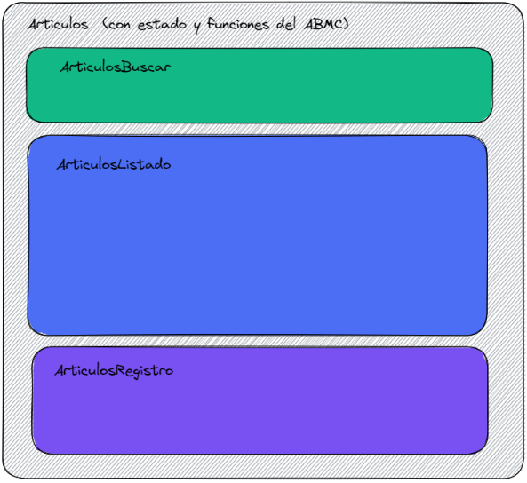

Como vemos la estructura propuesta incluye:

Un componente contenedor llamado `Articulos.jsx` el cual estará encargado de gestionar los estados, la funcionalidad necesaria para el ABMC y una interfaz visual mínima que incluye el título de la página.

y tres componentes hijos:

- `ArticulosBuscar.jsx` que permitirá filtrar la búsqueda de los Artículos según un par de parámetros: Nombre (descripción del artículo) y Activo (booleano que indica si el artículo está activo o no, se usa para la baja lógica).

- `ArticulosListado.jsx` que permitirá mostrar en una tabla un resumen (algunos campos representativos) del resultado de la búsqueda según los parámetros establecidos en el componente anterior (componente hermano). Aquí se incluye también: un contador de registros que cumplen la condición de filtrado, un paginador, un botón imprimir y un mensaje para avisar cuando no se encuentren resultados según el criterio establecido.

- `ArticulosRegistro` que permitirá ver todos los campos de un determinado registro seleccionado, los cuales podrán ser "Consultados" o "Modificados" y también esta misma interfaz se usará para dar de "Alta" un nuevo registro.